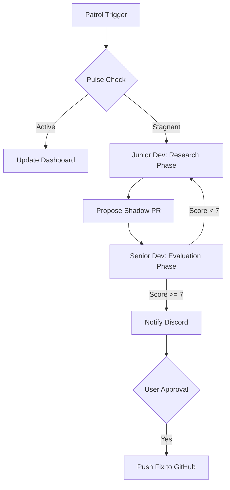

# Momentum: The Shadow Developer 🥷💻


**"Silence is not golden. Stagnation is silent. Momentum breaks the silence."**

Momentum is an autonomous AI agent that monitors your GitHub repositories for stagnation. When a project goes quiet (no commits for 3+ days), it wakes up, analyzes the codebase, and proposes high-impact "Shadow PRs" to unblock development.

## 🧠 The Accuracy Pipeline

Momentum uses a **Dual-Brain Architecture** to ensure production-grade proposals:



## 🚀 Key Features

*   **Accuracy Pipeline**: Uses Gemini 3 Flash in a "Generator-Evaluator" loop to self-correct hallucinations.
*   **Observability**: Deep-linked **Comet Opik** traces for every AI decision.
*   **24/7 Autonomous Patrol**: Hosted on **Zo Computer** for round-the-clock repository monitoring.
*   **Maintenance Mode**: Low-cost metadata syncing via `/momentum debug`.
*   **Interactive Dashboard**: Real-time fleet monitoring with "View Brain Trace" deep links.
*   **Cloud Native**: Built on **Google Cloud Platform** and **Firebase/Firestore**.

## 🛠️ Stack

*   **Brain**: Google Gemini 3 Flash (via Genkit)
*   **Body**: Node.js / TypeScript
*   **Runtime Host**: **Zo Computer** (24/7 dedicated container)
*   **Persistence**: **Google Firestore** (Real-time NoSQL)
*   **Deployment**: **Firebase App Hosting** (Dashboard)
*   **Memory**: Comet Opik (Tracing)
*   **Voice**: Discord.js
*   **Face**: Next.js (Dashboard)

## 📦 Installation

*(Steps truncated for brevity - see full guide...)*

## 🎮 Usage

### Discord Commands
*   `/momentum check <url>` - Manually trigger an analysis of a repository.
*   `/momentum patrol` - Triggers a full analysis cycle for all tracked repositories.
*   `/momentum debug` - Fast metadata sync (Skips LLM, updates Dashboard timestamps).
*   `/momentum untrack <url>` - Stop monitoring a project.
*   `/momentum-settings` - Configure timezone for nightly reports.

## 🏗️ System Architecture

```mermaid
flowchart LR
    Zo["Zo Computer (24/7 Bot)"] --> Engine[Core Engine]
    Engine --> Opik[Comet Opik]
    Engine --> Gemini[Gemini 3 Flash]
    Engine --> GitHub[GitHub API]
    Engine --> DB[(Google Firestore)]
    Dashboard[Firebase Hosting (Next.js)] --> DB
```
