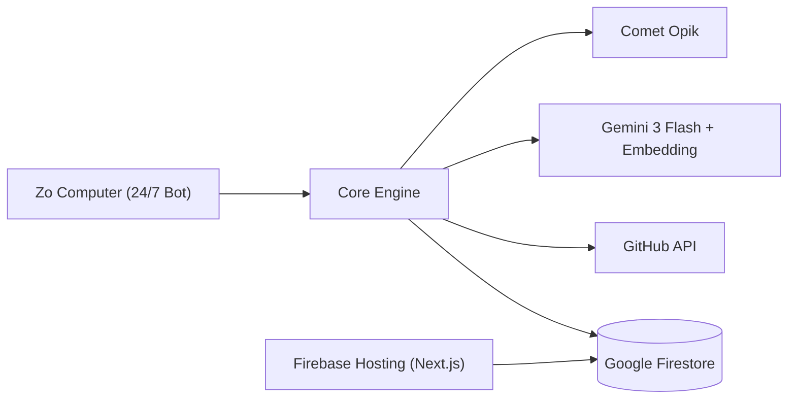

# Momentum: The Shadow Developer 🥷💻


**"Silence is not golden. Stagnation is silent. Momentum breaks the silence."**

Momentum is an autonomous AI agent that monitors your GitHub repositories for stagnation. When a project goes quiet (no commits for 3+ days), it wakes up, analyzes the codebase, and proposes high-impact "Shadow PRs" to unblock development.

## 🧠 The Accuracy Pipeline

Momentum uses a **Dual-Brain Architecture** to ensure production-grade proposals.

### The "Same Model" Paradox
"If both agents use Gemini 3 Flash, why is it better?"

The answer lies in **Cognitive Load** and **Persona constraints**.

| Feature | 🐣 Junior Dev (Generator) | 🧐 Senior Dev (Evaluator) |
| :--- | :--- | :--- |
| **System Prompt** | "You are a helpful, creative coder. Fix the problem." | "You are a strict, security-focused Architect. Find flaws." |
| **Context Window** | Full of file contents, tool outputs, and noise. | Clean. Only sees the *Proposal* and the *Rubric*. |
| **Goal** | **Recall & Synthesis** (Generate a solution). | **Classification & verification** (Grade a solution). |
| **Temperature** | Needs creativity (0.7). | Needs determinism (0.1). |

### The Workflow Loop

```mermaid
graph TD
    UserEnd(("Patrol Trigger")) -->|Trigger| ZoHost["Zo Computer (24/7 Runtime)"]
    ZoHost -->|Execute| Core[Core Engine]
    
    subgraph "Mode Select"
        Core --> Mode{Mode?}
        Mode -->|Debug| Sync[Pulse Sync Only]
        Mode -->|Plan| Recall{Recall Phase}
    end

    subgraph "The Hippocampus (Memory & Skills)"
        Recall -->|Search| Memories[("Firestore Memories")]
        Recall -->|Load| Skills[(".agent/skills/*.md")]
        Memories & Skills --> Enriched[Enriched System Prompt]
    end

    subgraph "Junior Dev (Generation Phase)"
        Enriched --> Research[Research Loop]
        Research -->|"listFiles / getFile"| Repo[("GitHub Repository")]
        Research -->|"Context Gathered"| Draft[Draft Proposal]
    end

    subgraph "Senior Dev (Evaluation Phase)"
        Draft -->|"2. submit for review"| Evaluator[Gemini 3 Flash Evaluator]
        Evaluator -->|"Check Rubric"| Score{"Score >= 7?"}
    end

    subgraph "Learning Loop"
        Score -->|"No"| LearnF[Save Negative Memory]
        Score -->|"Yes"| LearnS[Save Positive Memory]
        LearnF & LearnS --> Memories
        Score -->|"No"| Feedback["Generate Feedback"]
        Feedback -->|"3. Retry with Context"| Research
    end

    subgraph "Action Phase"
        Score -->|"Yes"| Discord[Discord Bot]
        Sync -->|Update Metadata| DB[("Google Firestore")]
        Discord -->|"4. Push Notification"| UserEnd
    end

    style Evaluator fill:#2d1b4e,stroke:#9d4edd,stroke-width:2px
    style Research fill:#1a2e35,stroke:#26c6da
    style Discord fill:#5865F2,color:white
    style Sync fill:#4a4e69
    style ZoHost fill:#f1c40f,color:black,stroke:#f39c12
    style Memories fill:#ff4757,color:white
    style Skills fill:#ffa502,color:black
```



### The Senior Dev's Rubric
The Evaluator doesn't just "look" at the code; it executes a strict **Reasoning Trace** (visible in **Opik** as the `momentum-evaluate` span) based on:
1.  **Safety**: Checks for `rm -rf`, secrets exposure, and dangerous imports.
2.  **Relevance**: Does the code change match the file context?
3.  **Correctness**: Scans for hallucinated syntax or logical errors.

## 🚀 Key Features

*   **Evolution (Long-Term Learning)**: Momentum now features a "Hippocampus"—a Firestore Vector store that tracks every success and failure. It uses **text-embedding-004** to recall similar past "Lessons Learned" and inject them into future plans.
*   **Skill Sync**: Automatically bridges the gap between AI and human standards by syncing your `.agent/skills/*.md` files directly into the reasoning context.
*   **Reflexion (Short-Term Learning)**: The "Junior Dev" automatically retries and fixes its own mistakes *before* alerting you, triggered by the Senior Dev's feedback.
*   **Accuracy Pipeline**: Uses a Dual-Brain architecture (Junior Dev vs. Senior Dev Architect) to reduce hallucinations.
*   **Cycle-Based Observability**: Groups Planning, Reasoning, and Execution traces into a single "Patrol Cycle" in Comet Opik.
*   **Zo Computer Hosting**: 24/7 autonomous runtime environment on a dedicated container.
*   **Dynamic Dashboard**: Real-time fleet monitoring with **Google Firestore** persistence and deep-trace links.

## 🔮 Professional Observability (Opik)

Momentum is not a black box. Every decision is fully traceable using **Comet Opik**.

### Tracing Hierarchy
Each patrol cycle generates a structured trace linked directly to the repository:

*   **`momentum-plan`** (Root): Tracks the overall latency (e.g., 24.5s) and cost.
    *   **`pulse-check`** (Span): GitHub API overhead and stagnation logic.
    *   **`brain-research`** (Span): The Junior Dev's iterative research tool calls (`listFiles`, `readFile`).
    *   **`momentum-evaluate`** (Span): The Senior Dev's rubric evaluation and score.

### Deep Linking
The Dashboard provides a **"View Brain Trace"** button for every monitored repository. One click takes you from a "Status: Active" badge directly to the generative logic that produced it.

## 🛠️ Stack

*   **Brain**: Google Gemini 3 Flash (Reasoning) & **text-embedding-004** (Memory)
*   **Body**: Node.js / TypeScript
*   **Runtime Host**: **Zo Computer** (24/7 dedicated container)
*   **Persistence**: **Google Firestore** (Real-time NoSQL)
*   **Deployment**: **Firebase App Hosting** (Dashboard)
*   **Memory**: Comet Opik (Tracing)
*   **Voice**: Discord.js
*   **Face**: Next.js (Dashboard)

## 📚 Technical Deep Dives

For a more granular look at how Momentum operates, check out these guides:
*   [**Workflow Architecture**](workflow_architecture.md): Deep dive into the Junior/Senior dev loop and the Hippocampus memory system.
*   [**Zo Deployment & Stability**](zo_sitrep.md): How we handle the autonomous 24/7 runtime and "Zombie" process prevention.
*   [**Uptime & Monitoring**](uptime_guide.md): Understanding the difference between machine uptime and bot stability on Zo.

## 📦 Installation

1.  **Clone & Install**
    ```bash
    git clone https://github.com/nashy3k/momentum-shadow-dev.git
    cd momentum-shadow-dev
    npm install
    ```

2.  **Environment Setup**
    Create a `.env` file in the root:
    ```env
    GOOGLE_API_KEY=AIzaSy... # Gemini API Key
    DISCORD_TOKEN=MTQ2...    # Discord Bot Token
    GITHUB_TOKEN=ghp_...     # Classic Token (with repo/workflow scopes)
    OPIK_API_KEY=...         # Comet Opik API Key
    OPIK_WORKSPACE=...
    ```

3.  **Run the Bot**
    ```bash
    npm run start-bot
    ```

4.  **The Dashboard**
    The dashboard is a separate project in the `web/` folder.
    ```bash
    cd web
    npm install
    npm run dev
    # Open http://localhost:3000
    ```

## 🎮 Usage

### Discord Commands
*   `/momentum check <url>` - Manually trigger an analysis of a repository.
*   `/momentum patrol` - Triggers a full analysis cycle for all tracked repositories.
*   `/momentum debug` - Fast metadata sync (Skips LLM, updates Dashboard timestamps).
*   `/momentum untrack <url>` - Stop monitoring a project.
*   `/momentum-settings` - Configure timezone for nightly reports.

## 🏗️ System Architecture



## 🔮 Future Roadmap (Phase 10+)

*   **Autonomous Debugging Hub**: Integrate with GitHub Actions to automatically pull build logs and "Self-Repair" the code before a human even sees the failure.
*   **Multi-Agent Swarm**: Deploy specialized agents for different domains (Security, UX, DevOps) that debate each other in the "Senior Dev" phase to reach a consensus.
*   **Zero-Knowledge Secrets**: Implement an encrypted vault for bot keys so users can delegate repository access with 100% security.

## 📜 License

This project is licensed under the **Polyform Noncommercial License 1.0.0**. 

*   **Non-commercial Use Only**: You are free to view, fork, and use this code for personal, educational, or testing purposes.
*   **Commercial Use Restricted**: Commercial use, including running this bot as a paid service or using the logic in commercial products, is strictly prohibited without explicit permission from the author.

See the [LICENSE](LICENSE) file for the full legal text.
