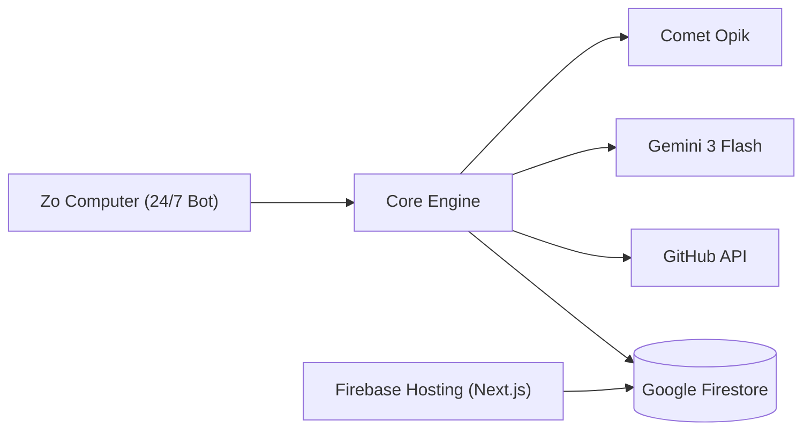

# Momentum: The Shadow Developer 🥷💻


**"Silence is not golden. Stagnation is silent. Momentum breaks the silence."**

Momentum is an autonomous AI agent that monitors your GitHub repositories for stagnation. When a project goes quiet (no commits for 3+ days), it wakes up, analyzes the codebase, and proposes high-impact "Shadow PRs" to unblock development.

## 🧠 The Accuracy Pipeline

Momentum uses a **Dual-Brain Architecture** to ensure production-grade proposals.

### The "Same Model" Paradox
"If both agents use Gemini 3 Flash, why is it better?"

The answer lies in **Cognitive Load** and **Persona constraints**.

| Feature | 🐣 Junior Dev (Generator) | 🧐 Senior Dev (Evaluator) |
| :--- | :--- | :--- |
| **System Prompt** | "You are a helpful, creative coder. Fix the problem." | "You are a strict, security-focused Architect. Find flaws." |
| **Context Window** | Full of file contents, tool outputs, and noise. | Clean. Only sees the *Proposal* and the *Rubric*. |
| **Goal** | **Recall & Synthesis** (Generate a solution). | **Classification & verification** (Grade a solution). |
| **Temperature** | Needs creativity (0.7). | Needs determinism (0.1). |

### The Workflow Loop

```mermaid
graph TD
    UserEnd(("Patrol Trigger")) -->|Trigger| ZoHost["Zo Computer (24/7 Runtime)"]
    ZoHost -->|Execute| Core[Core Engine]
    
    subgraph "Mode Select"
        Core --> Mode{Mode?}
        Mode -->|Debug| Sync[Pulse Sync Only]
        Mode -->|Plan| Detect{Stagnant?}
    end

    subgraph "Junior Dev (Generation Phase)"
        Detect -->|Yes| Research[Research Loop]
        Research -->|"listFiles / getFile"| Repo[("GitHub Repository")]
        Research -->|"Context Gathered"| Draft[Draft Proposal]
    end

    subgraph "Senior Dev (Evaluation Phase)"
        Draft -->|"2. submit for review"| Evaluator[Gemini 3 Flash Evaluator]
        Evaluator -->|"Check Rubric"| Score{"Score >= 7?"}
    end

    subgraph "Feedback Loop"
        Score -->|"No"| Feedback["Generate Feedback"]
        Feedback -->|"3. Retry with Context"| Research
    end

    subgraph "Action Phase"
        Score -->|"Yes"| Discord[Discord Bot]
        Sync -->|Update Metadata| DB[("Google Firestore")]
        Discord -->|"4. Push Notification"| UserEnd
    end

    style Evaluator fill:#2d1b4e,stroke:#9d4edd,stroke-width:2px
    style Research fill:#1a2e35,stroke:#26c6da
    style Discord fill:#5865F2,color:white
    style Sync fill:#4a4e69
    style ZoHost fill:#f1c40f,color:black,stroke:#f39c12
```



### The Senior Dev's Rubric
The Evaluator doesn't just "look" at the code; it executes a strict **Reasoning Trace** based on:
1.  **Safety**: Checks for `rm -rf`, secrets exposure, and dangerous imports.
2.  **Relevance**: Does the code change match the file context?
3.  **Correctness**: Scans for hallucinated syntax or logical errors.

## 🚀 Key Features

*   **Accuracy Pipeline**: Uses Gemini 3 Flash in a "Generator-Evaluator" loop to self-correct hallucinations.
*   **Observability**: Deep-linked **Comet Opik** traces for every AI decision.
*   **24/7 Autonomous Patrol**: Hosted on **Zo Computer** for round-the-clock repository monitoring.
*   **Maintenance Mode**: Low-cost metadata syncing via `/momentum debug`.
*   **Interactive Dashboard**: Real-time fleet monitoring with "View Brain Trace" deep links.
*   **Cloud Native**: Built on **Google Cloud Platform** and **Firebase/Firestore**.

## 🔮 Professional Observability (Opik)

Momentum is not a black box. Every decision is fully traceable using **Comet Opik**.

### Tracing Hierarchy
Each patrol cycle generates a structured trace linked directly to the repository:

*   **`momentum-plan`** (Root): Tracks the overall latency (e.g., 24.5s) and cost.
    *   **`pulse-check`** (Span): GitHub API overhead and stagnation logic.
    *   **`brain-research`** (Span): The Junior Dev's iterative research tool calls (`listFiles`, `readFile`).
    *   **`momentum-evaluate`** (Span): The Senior Dev's rubric evaluation and score.

### Deep Linking
The Dashboard provides a **"View Brain Trace"** button for every monitored repository. One click takes you from a "Status: Active" badge directly to the generative logic that produced it.

## 🛠️ Stack

*   **Brain**: Google Gemini 3 Flash (via Genkit)
*   **Body**: Node.js / TypeScript
*   **Runtime Host**: **Zo Computer** (24/7 dedicated container)
*   **Persistence**: **Google Firestore** (Real-time NoSQL)
*   **Deployment**: **Firebase App Hosting** (Dashboard)
*   **Memory**: Comet Opik (Tracing)
*   **Voice**: Discord.js
*   **Face**: Next.js (Dashboard)

## 📦 Installation

1.  **Clone & Install**
    ```bash
    git clone https://github.com/nashy3k/momentum-shadow-dev.git
    cd momentum-shadow-dev
    npm install
    ```

2.  **Environment Setup**
    Create a `.env` file in the root:
    ```env
    GOOGLE_API_KEY=AIzaSy... # Gemini API Key
    DISCORD_TOKEN=MTQ2...    # Discord Bot Token
    GITHUB_TOKEN=ghp_...     # Classic Token (with repo/workflow scopes)
    OPIK_API_KEY=...         # Comet Opik API Key
    OPIK_WORKSPACE=...
    ```

3.  **Run the Bot**
    ```bash
    npm run start-bot
    ```

4.  **The Dashboard**
    The dashboard is a separate project in the `web/` folder.
    ```bash
    cd web
    npm install
    npm run dev
    # Open http://localhost:3000
    ```

## 🎮 Usage

### Discord Commands
*   `/momentum check <url>` - Manually trigger an analysis of a repository.
*   `/momentum patrol` - Triggers a full analysis cycle for all tracked repositories.
*   `/momentum debug` - Fast metadata sync (Skips LLM, updates Dashboard timestamps).
*   `/momentum untrack <url>` - Stop monitoring a project.
*   `/momentum-settings` - Configure timezone for nightly reports.

## 🏗️ System Architecture



## 🔮 Future Roadmap (The "Evolution" Phase)

*   **Self-Reinforcement**: Feed accepted/rejected "Shadow PR" data back into the Brain to teach it your specific coding style over time.
*   **Multi-Repo Awareness**: Allow the bot to see "how we did it in the other repo" to solve cross-project dependency issues.

## 📜 License

MIT
