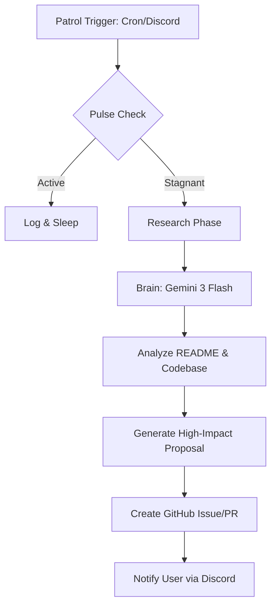
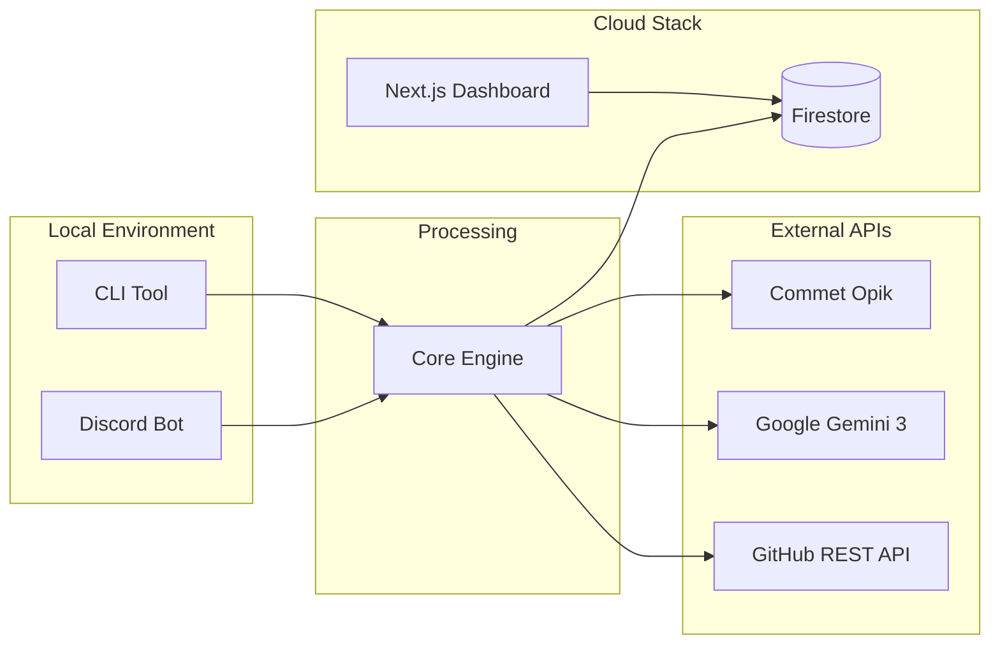

# Momentum: The Shadow Developer 🥷💻


**"Silence is not golden. Stagnation is silent. Momentum breaks the silence."**

Momentum is an autonomous AI agent that monitors your GitHub repositories for stagnation. When a project goes quiet (no commits for 3+ days), it wakes up, analyzes the codebase, and proposes high-impact "Shadow PRs" to unblock development—all without you asking.

## 🧠 The Agentic Flow



## 🏗️ System Architecture



## 🚀 Key Features

*   **Autonomy**: Automatically detects inactive repos.
*   **Context-Aware**: Reads your README and file structure to make intelligent suggestions (e.g., "Add a Service Worker for offline support" for an app).
*   **Interactive**: Chat with it via Discord (`/momentum check`) or run it on a nightly cron schedule.
*   **Observable**: All AI reasoning is traced in **Comet Opik** for full transparency.
*   **Cloud Native**: Built on Google Cloud Functions (Gen 2) and Firebase.

## 🛠️ Stack

*   **Brain**: Google Gemini 3 Flash (via Genkit)
*   **Body**: Node.js / TypeScript
*   **Eyes**: GitHub API (REST)
*   **Memory**: Comet Opik (Tracing)
*   **Voice**: Discord.js
*   **Face**: Next.js (Dashboard)

## 📦 Installation

1.  **Clone & Install**
    ```bash
    git clone https://github.com/nashy3k/momentum-shadow-dev.git
    cd momentum-shadow-dev
    npm install
    ```

2.  **Environment Setup**
    Create a `.env` file:
    ```env
    GOOGLE_API_KEY=AIzaSy...
    DISCORD_TOKEN=MTQ2...
    GITHUB_TOKEN=ghp_...
    OPIK_API_KEY=...
    OPIK_WORKSPACE=...
    ```

3.  **Run the Bot**
    ```bash
    npm run start-bot
    ```

## 🎮 Usage

### Discord Commands
*   `/momentum check repo:<url>` - Instantly audit a specific repository.
*   `/momentum-settings timezone:<zone>` - Set your local time for nightly reports.

### The Dashboard
View your fleet of repositories and their health status.
```bash
cd web
npm run dev
# Open localhost:3000
```

## ☁️ Deployment

Momentum is designed for Firebase Cloud Functions (Gen 2).
```powershell
./deploy.ps1
```

## 📜 License

MIT
