# Momentum Agentic Workflow: The "Two-Brain" System

## The "Same Model" Paradox
The answer lies in **Cognitive Load** and **Persona constraints**.

| Feature | 🐣 Junior Dev (Generator) | 🧐 Senior Dev (Evaluator) |
| :--- | :--- | :--- |
| **System Prompt** | "You are a helpful, creative coder. Fix the problem." | "You are a strict, security-focused Architect. Find flaws." |
| **Context Window** | Full of file contents, tool outputs, and noise. | Clean. Only sees the *Proposal* and the *Rubric*. |
| **Goal** | **Recall & Synthesis** (Generate a solution). | **Classification & verification** (Grade a solution). |
| **Temperature** | High (0.7) - Needs creativity. | Low (0.1) - Needs determinism. |

## The Workflow Diagram

```mermaid
graph TD
    UserEnd(("User / Cron")) -->|Trigger| ZoHost["Zo Computer (24/7 Runtime)"]
    ZoHost -->|Execute| Core[Core Engine]
    
    subgraph "Mode Select"
        Core --> Mode{Mode?}
        Mode -->|Debug| Sync[Pulse Sync Only]
        Mode -->|Plan| Recall{Recall Phase}
    end

    subgraph "The Hippocampus (Memory & Skills)"
        Recall -->|Vector Search| Memories[("Firestore Memories")]
        Recall -->|Local Read| Skills[(".agent/skills/*.md")]
        Memories & Skills --> Enriched[Enriched System Prompt]
    end

    subgraph "Junior Dev (Generation Phase)"
        Enriched --> Research[Research Loop]
        Research -->|"listFiles / getFile"| Repo[("GitHub Repository")]
        Research -->|"Context Gathered"| Draft[Draft Proposal]
    end

    subgraph "Senior Dev (Evaluation Phase)"
        Draft -->|"2. submit for review"| Evaluator[Gemini 2.0 Flash Evaluator]
        Evaluator -->|"Check Rubric"| Score{"Score >= 7?"}
    end

    subgraph "Learning Loop"
        Score -->|"No"| LearnF[Save Negative Memory]
        Score -->|"Yes"| LearnS[Save Positive Memory]
        LearnF & LearnS --> Memories
        Score -->|"No"| Feedback["Generate Feedback"]
        Feedback -->|"3. Retry with Context"| Research
    end

    subgraph "Action Phase"
        Score -->|"Yes"| Discord[Discord Bot]
        Sync -->|Update Metadata| DB[("Google Firestore")]
        Discord -->|"4. Review Request"| UserReview(["Human Approval"])
        UserReview -->|"Approve"| Push[Execute Shadow PR]
        UserReview -->|"Reject"| LearnH[Save Human Memory]
        LearnH --> Memories
    end

    style Evaluator fill:#2d1b4e,stroke:#9d4edd,stroke-width:2px
    style Research fill:#1a2e35,stroke:#26c6da
    style Discord fill:#5865F2,color:white
    style Sync fill:#4a4e69
    style ZoHost fill:#f1c40f,color:black,stroke:#f39c12
    style Memories fill:#ff4757,color:white
    style Skills fill:#ffa502,color:black
    style UserReview fill:#27ae60,color:white
    style UserReview fill:#27ae60,color:white

    %% Opik Tracing Layer
    subgraph "Comet Opik Observability"
        direction LR
        Trace1[("Trace: brain-research")] 
        Trace2[("Trace: momentum-evaluate")]
        Trace3[("Trace: momentum-execute")]
    end

    Research -.->|"Log Span"| Trace1
    Evaluator -.->|"Log Span"| Trace2
    Push -.->|"Log Span"| Trace3
    
    style Trace1 fill:#e056fd,color:white
    style Trace2 fill:#e056fd,color:white
    style Trace3 fill:#e056fd,color:white
```

## The Learning Mechanism (Reflexion vs. Evolution)
You asked: *"Does this system learn from itself?"*

Yes, in two distinct ways. We have implemented the first, and the second is our roadmap.

### 1. Short-Term Learning (Reflexion) ✅ *Implemented*
This is the **Feedback Loop** in the diagram above.
*   **How it works**: When the *Senior Dev* rejects a proposal, it doesn't just say "No". It provides a detailed critique (e.g., "You forgot to handle the error in line 45").
*   **The Learning**: The *Junior Dev* takes this critique and its original draft, and "reflects" on the mistake to generate a superior second draft.
*   **Result**: The system "learns" within the span of 30 seconds. It solves problems it couldn't solve in a single shot.

### 2. Long-Term Learning (Evolution) ✅ *Implemented*
*   **The Concept**: Every interaction and feedback is stored in the **Hippocampus** (Firestore Vector Store).
*   **How it works**: Momentum uses Genkit's `gemini-embedding-001` to vectorize successes and failures.
*   **The Recall**: During the next planning phase, the engine performs a RAG (Retrieval-Augmented Generation) search for relevant "Lessons Learned" and injects them into the Junior Dev's system prompt.
*   **Expert System Skills**: The engine also bridges the gap with explicit human guidance by automatically syncing `.agent/skills/*.md` files into the reasoning context.
*   **Human-in-the-loop Learning**: Rejections on Discord are captured as "Negative Memories," ensuring the bot doesn't make the same stylistic mistake twice.
*   **Result**: The system evolves with every repo check, becoming a permanently improving partner that follows your project-specific standards.

## 🧠 The "Golden Nugget": Hybrid SDK Strategy

One of the most powerful architectural decisions in Momentum is the **split-brain SDK implementation**. Rather than fighting with a single abstraction, we leverage the distinct strengths of two Google-native libraries alongside the Gemini 3 Flash model.

| SDK | Component | Reason for Choice |
| :--- | :--- | :--- |
| **Google Generative AI SDK** | **The Planner (CoreEngine)** | **Low-Level Control**: The `generateContent` API provides raw access to token streams. Crucial for the "Senior Dev" persona to prevent hallucinations.  **Specs**: • File: `src/core/engine.ts` • Model: `gemini-2.0-flash` • Why: Verified Gemini 2.0 stability. |
| **Firebase Genkit** | **The Memory (Hippocampus)** | **Type-Safe Abstraction**: Genkit shines at "Flows" by handling the vectorization pipeline with zero friction.  **Specs**: • File: `src/core/memory.ts` • Plugin: `googleai/gemini-2.0-flash` • Why: Genkit's stable wrapper for the latest Flash model. |

**Why this matters for your demo:**
> "We didn't just use a framework. We architected a hybrid. We use raw metal (SDK) for the thinking, and modern plumbing (Genkit) for the memory. This gives us the speed of a script with the structure of an enterprise app."

## 🛠️ Tech Stack: Why Genkit? (vs LangChain / n8n)

Momentum chose **Firebase Genkit** as its backbone for robust, production-grade AI integration. Here is the comparison for your slide deck:

### 1. Code-First vs. Graph-First (vs n8n)
*   **The Problem with n8n**: Low-code tools are great for prototyping, but `JSON` logic gets messy at scale.
*   **The Genkit Win**: Momentum is written in **TypeScript**. Our prompts, flows, and memory logic are strongly typed. If the API schema changes, our build fails *before* deployment, not during the demo.

### 2. Native Google Integration (vs LangChain)
*   **The Problem with LangChain**: It's a "Generic Wrapper". It adds varied latency and abstraction layers to support every model under the sun.
*   **The Genkit Win**: Genkit is built *by* the Firebase/Google team. It has first-party support for `gemini-2.0-flash` and `gemini-embedding-001`. There is no "translation layer"—it is pure, optimized utilization of the Google Cloud infrastructure.

### 3. Observability Out-of-the-Box
*   **The Feature**: Genkit's Developer UI allows us to inspect the "Memory" flow in real-time. We can see exactly what the embedding vector looks like and which "Lesson Learned" was retrieved, without adding a single line of `console.log`.

## Professional Observability (Opik Cycle-Based Linking)
To ensure the system isn't a "Black Box", every patrol cycle is unified under a unique **Cycle ID**. This links three distinct traces in **Comet Opik** into a single cohesive narrative:

1.  **`momentum-plan`** (Root Trace)
    *   Junior Dev loop (`brain-research`) and initial proposal.
2.  **`momentum-evaluate`** (Evaluation Trace)
    *   Senior Dev's **Reasoning Trace** and numerical `score`.
3.  **`momentum-execute`** (Action Trace)
    *   The final creation of the GitHub Issue/PR.

**The Filter**: The Dashboard deep-links using `tags contains cycle:<id>`, ensuring that when a user clicks **"View Patrol Cycle"**, they see all three phases (The Thought, The Audit, and The Action) at once. This 100% transparency is a core design principle of Momentum.

### Core Opik Applications
The three major innovations:

1.  **The "Cycle ID" Strategy**:
    *   *Problem*: Async bots often lose context between the "Plan" (Job A) and the "Execution" (Job B) which might happen hours later after human approval.
    *   *Solution*: We persist a generic `cycle_id` in Firestore. When the user clicks "Approve" in Discord, we re-hydrate that ID and tag the execution trace. This stitches together a fragmented timeline into one cohesive Opik story.

2.  **LLM-as-a-Judge Implementation**:
    *   We don't just "log" data. We use Opik to trace the **Senior Dev's Evaluation**.
    *   The `momentum-evaluate` span captures the input (Draft Code), the output (Score), and the *reasoning* (The Critique). This creates a dataset that we can use to fine-tune the Junior Dev later.

3.  **Deep-Linking from Dashboards**:
    *   We treat Opik as a "Customer-Facing" feature. The "View Brain Trace" button isn't just for us—it's for the end-user to trust the bot.

## Operations: Maintenance Mode (The Debug Command)
Usage: `/momentum debug`
This mode triggers the **Pulse Sync Only** branch on the **Zo Computer**. It updates the **Firestore** metadata (days stagnant, last commit) without triggering LLM calls. This allows for frequent UI updates without cost or latency.
