# Momentum Agentic Workflow: The "Two-Brain" System

## The "Same Model" Paradox
The answer lies in **Cognitive Load** and **Persona constraints**.

| Feature | 🐣 Junior Dev (Generator) | 🧐 Senior Dev (Evaluator) |
| :--- | :--- | :--- |
| **System Prompt** | "You are a helpful, creative coder. Fix the problem." | "You are a strict, security-focused Architect. Find flaws." |
| **Context Window** | Full of file contents, tool outputs, and noise. | Clean. Only sees the *Proposal* and the *Rubric*. |
| **Goal** | **Recall & Synthesis** (Generate a solution). | **Classification & verification** (Grade a solution). |
| **Temperature** | High (0.7) - Needs creativity. | Low (0.1) - Needs determinism. |

## The Workflow Diagram

### 1. Presentation View (Simplified)
Use this for your **Pitch Deck Slides**. It focuses on the value loop: `Trigger -> Brain -> Action`.

```mermaid
graph LR
    %% Styles
    classDef trigger fill:#E1F5FE,stroke:#039BE5,stroke-width:2px,color:black
    classDef agent fill:#F3E5F5,stroke:#8E24AA,stroke-width:2px,color:black
    classDef action fill:#E8F5E9,stroke:#43A047,stroke-width:2px,color:black
    classDef infra fill:#FFF3E0,stroke:#FB8C00,stroke-width:2px,stroke-dasharray: 5 5,color:black

    %% Nodes
    subgraph "The Trigger"
        User(👨‍💻 Developer) -->|"1. !help I'm stuck"| Discord
        Cron(⏰ Daily Patrol) -->|"2. Detect Stagnation"| Discord
    end

    subgraph "Momentum Agent (The Brain)"
        Discord -->|"3. Wake Up"| Plan[🐣 Junior Dev (Planner)]
        Plan -->|"4. Research"| Context[(Files & Docs)]
        Context --> Plan
        Plan -->|"5. Draft Code"| Review[🧐 Senior Dev (Architect)]
        Review -->|"6. Approve/Reject"| Decision{Score > 7?}
    end

    subgraph "The Output"
        Decision -->|Yes| PR[🚀 Shadow PR Created]
        Decision -->|No| Learn[📝 Save Lesson to Memory]
        PR -->|"7. Unblock User"| User
    end

    %% Apply Styles
    class User,Cron,Discord trigger
    class Plan,Context,Review,Decision agent
    class PR,Learn action
```

### 2. Engineering View (Detailed)
Use this for the **README** and technical docs. It includes the database schema and observability layers.

```mermaid
graph TD
    UserEnd(("User / Cron")) -->|Trigger| ZoHost["Zo Computer (24/7 Runtime)"]
    ZoHost -->|Execute| Core[Core Engine]
    
    subgraph "Mode Select"
        Core --> Mode{Mode?}
        Mode -->|Debug| Sync[Pulse Sync Only]
        Mode -->|Plan| Recall{Recall Phase}
    end

    subgraph "The Hippocampus (Memory & Skills)"
        Recall -->|Vector Search| Memories[(Firestore Memories)]
        Recall -->|Local Read| Skills[(".agent/skills/*.md")]
        Memories & Skills --> Enriched[Enriched System Prompt]
    end

    subgraph "Junior Dev (Generation Phase)"
        Enriched --> Research[Research Loop]
        Research -->|"listFiles / getFile"| Repo[(GitHub Repository)]
        Research -->|"Context Gathered"| Draft[Draft Proposal]
    end

    subgraph "Senior Dev (Evaluation Phase)"
        Draft -->|"2. submit for review"| Evaluator[Gemini 3 Flash Evaluator]
        Evaluator -->|"Check Rubric"| Score{"Score >= 7?"}
    end

    subgraph "Learning Loop"
        Score -->|"No"| LearnF[Save Negative Memory]
        Score -->|"Yes"| LearnS[Save Positive Memory]
        LearnF & LearnS --> Memories
        Score -->|"No"| Feedback["Generate Feedback"]
        Feedback -->|"3. Retry with Context"| Research
    end

    subgraph "Action Phase"
        Score -->|"Yes"| Discord[Discord Bot]
        Sync -->|Update Metadata| DB[(Google Firestore)]
        Discord -->|"4. Review Request"| UserReview(["Human Approval"])
        UserReview -->|"Approve"| Push[Execute Shadow PR]
        UserReview -->|"Reject"| LearnH[Save Human Memory]
        UserReview -->|"Score Trace"| OpikFB[[Opik Feedback Score 0.0 / 1.0]]
        Push -->|"Status: ACCEPTED"| Proposals["Firestore Proposals"]
        LearnH --> Proposals
        LearnH --> Memories
    end

    style Evaluator fill:#2d1b4e,stroke:#9d4edd,stroke-width:2px
    style Research fill:#1a2e35,stroke:#26c6da
    style Discord fill:#5865F2,color:white
    style Sync fill:#4a4e69
    style ZoHost fill:#f1c40f,color:black,stroke:#f39c12
    style Memories fill:#ff4757,color:white
    style Skills fill:#ffa502,color:black
    style UserReview fill:#27ae60,color:white

    %% Opik Tracing Layer
    subgraph "Comet Opik Observability"
        direction LR
        Trace1[("Trace: brain-research")] 
        Trace2[("Trace: momentum-evaluate")]
        Trace3[("Trace: momentum-execute")]
    end

    Research -.->|"Log Span"| Trace1
    Evaluator -.->|"Log Span"| Trace2
    Push -.->|"Log Span"| Trace3
    
    style Trace1 fill:#e056fd,color:white
    style Trace2 fill:#e056fd,color:white
    style Trace3 fill:#e056fd,color:white
```




## Strategic Observability Value (Comet Opik)
By unifying every patrol cycle under a unique **Cycle ID**, Momentum establishes a transparent audit trail for autonomous decisions. This links three distinct operational phases in **Comet Opik** into a single cohesive narrative:

1.  **`momentum-plan`** (Research Phase)
    *   Junior Dev research iterations (`brain-research`) and draft proposal generation.
2.  **`momentum-evaluate`** (Audit Phase)
    *   Senior Dev's **Reasoning Trace** and quantitative evaluation scores.
3.  **`momentum-execute`** (Action Phase)
    *   The formalized creation of the GitHub Issue or Pull Request.

**Unified Visibility**: The Dashboard utilizes deep-linking via query tags (`tags contains cycle:<id>`), ensuring that stakeholders can witness the progression from initial thought to final action with 100% transparency—a core design principle of the Momentum architecture.

### Key Innovations for Evaluators
For technical reviewers and the Opik team, Momentum demonstrates advanced implementation of the following concepts:

1.  **Asynchronous Timeline Stitching (Cycle ID)**:
    *   Handles the challenge of maintaining context across disconnected operational windows (Research vs. Human-delayed Execution).
    *   Persists a unique `cycle_id` in Firestore, allowing the system to re-hydrate and tag execution traces hours or days after the initial plan was generated.

2.  **LLM-as-a-Judge Tracing**:
    *   Leverages Opik not just for logging, but for auditing the decision-making rubric of the "Senior Dev" evaluator.
    *   Captures high-fidelity reasoning traces alongside numerical scores, creating a structured dataset for future model fine-tuning.

3.  **Observability as a User Feature**:
    *   Elevates tracing from a developer tool to a trust-building feature. The "View Brain Trace" deep-link empowers users to understand the *why* behind every autonomous change.

## The Learning Mechanism (Reflexion vs. Evolution)
The system employs a dual-layered learning strategy to ensure continuous improvement in performance and alignment.

### 1. Short-Term Learning (Reflexion) ✅ *Implemented*
*   **Operational Flow**: Rejections from the Senior Dev trigger a "Reflexion" loop.
*   **Methodology**: The Junior Dev receives a specific critique (e.g., "Error handling missing on line 45") and uses this as context to generate a superior second iteration.
*   **Outcome**: Intra-cycle error correction that prevents flawed proposals from reaching the human reviewer.

### 2. Long-Term Learning (Evolution) ✅ *Implemented*
*   **Concept**: Every interaction and bit of feedback is persisted to the **Hippocampus** (Firestore Vector Store).
*   **Methodology**: Momentum utilizes `gemini-embedding-001` to vectorize successes, failures, and human stylistic preferences.
*   **Contextual Recall**: During planning, the engine performs RAG-based retrieval on past "Lessons Learned," injecting high-relevance tribal knowledge into the generation prompt.
*   **Expert System Integration**: Automatically synchronizes human-authored `.agent/skills/*.md` files into the reasoning context, bridging the gap between AI intuition and team-specific standards.

## 🧠 Strategic SDK Implementation: The Hybrid Strategy
Momentum utilizes a **split-brain SDK architecture**, leveraging the specific strengths of distinct libraries to optimize performance.

| SDK | Application | Rationale |
| :--- | :--- | :--- |
| **Google Generative AI SDK** | **Planner (CoreEngine)** | **Low-Level Precision**: The raw `generateContent` API provides granular control over token streams and model parameters, essential for high-fidelity reasoning. |
| **Firebase Genkit** | **Memory (Hippocampus)** | **Type-Safe Abstraction**: Genkit excels at managing "Flows" and vectorization pipelines with strong typing (Zod) and built-in tracing. |

## 🛠️ Framework Comparison: Why Genkit?

| Framework | Target Use Case | Momentum Choice Logic |
| :--- | :--- | :--- |
| **LangChain** | Generic Model Wrapping | **Avoided**: High abstraction overhead and inconsistent latency across different model adapters. |
| **n8n** | Node-Based Prototyping | **Avoided**: Complex logic becomes unmanageable in graph-based JSON structures; lacks strong typing. |
| **Vercel AI SDK** | Frontend/Chat UIs | **Avoided for Backend**: Excellent for React Hooks and streaming to UI, but lacks Genkit's robust backend "Flow" orchestration and deep Google Cloud/Firestore primitives. |
| **Firebase Genkit** | **Production AI Services** | **Chosen**: First-party Google/Firebase optimization, native Gemini/Vertex support, and superior local developer UI for tracing. |

## ⚙️ System Operations & Maintenance

### The Debug Command (Metadata Refresh)
**Usage**: `/momentum debug`
**Function**: Triggers a **Pulse Sync** cycle that bypasses LLM logic to refresh repository metadata (stagnation status, last commit metrics) in Firestore. This ensures the Dashboard remains accurate without incurring unnecessary token latency or cost.

### Zo Runtime Stability (Resilience Mesh)
The bot utilizes a hybrid resilience model to maintain 24/7 availability on the Zo Free Tier:

1.  **Managed Service**: The process is supervised by the Zo "Sites" engine with the entrypoint `npm run start-bot`. This ensures the process is "Auto-Healed" upon container wake-up.
2.  **External Pulse (UptimeRobot)**: Pings the public endpoint every 5 minutes to trigger the Zo infrastructure's wake-up mechanism.
3.  **Graceful Exit**: Implements a `SIGTERM` handler ("Last Gasp") to notify Discord before the container undergoes scheduled rotation or sleep, ensuring transition visibility.
