# Momentum Agentic Workflow: The "Two-Brain" System

## The "Same Model" Paradox
The answer lies in **Cognitive Load** and **Persona constraints**.

| Feature | 🐣 Junior Dev (Generator) | 🧐 Senior Dev (Evaluator) |
| :--- | :--- | :--- |
| **System Prompt** | "You are a helpful, creative coder. Fix the problem." | "You are a strict, security-focused Architect. Find flaws." |
| **Context Window** | Full of file contents, tool outputs, and noise. | Clean. Only sees the *Proposal* and the *Rubric*. |
| **Goal** | **Recall & Synthesis** (Generate a solution). | **Classification & verification** (Grade a solution). |
| **Temperature** | High (0.7) - Needs creativity. | Low (0.1) - Needs determinism. |

## The Workflow Diagram

```mermaid
graph TD
    UserEnd(("User / Cron")) -->|Trigger| ZoHost["Zo Computer (24/7 Runtime)"]
    ZoHost -->|Execute| Core[Core Engine]
    
    subgraph "Mode Select"
        Core --> Mode{Mode?}
        Mode -->|Debug| Sync[Pulse Sync Only]
        Mode -->|Plan| Recall{Recall Phase}
    end

    subgraph "The Hippocampus (Memory & Skills)"
        Recall -->|Vector Search| Memories[("Firestore Memories")]
        Recall -->|Local Read| Skills[(".agent/skills/*.md")]
        Memories & Skills --> Enriched[Enriched System Prompt]
    end

    subgraph "Junior Dev (Generation Phase)"
        Enriched --> Research[Research Loop]
        Research -->|"listFiles / getFile"| Repo[("GitHub Repository")]
        Research -->|"Context Gathered"| Draft[Draft Proposal]
    end

    subgraph "Senior Dev (Evaluation Phase)"
        Draft -->|"2. submit for review"| Evaluator[Gemini 3 Flash Evaluator]
        Evaluator -->|"Check Rubric"| Score{"Score >= 7?"}
    end

    subgraph "Learning Loop"
        Score -->|"No"| LearnF[Save Negative Memory]
        Score -->|"Yes"| LearnS[Save Positive Memory]
        LearnF & LearnS --> Memories
        Score -->|"No"| Feedback["Generate Feedback"]
        Feedback -->|"3. Retry with Context"| Research
    end

    subgraph "Action Phase"
        Score -->|"Yes"| Discord[Discord Bot]
        Sync -->|Update Metadata| DB[("Google Firestore")]
        Discord -->|"4. Review Request"| UserReview(["Human Approval"])
        UserReview -->|"Approve"| Push[Execute Shadow PR]
        UserReview -->|"Reject"| LearnH[Save Human Memory]
        LearnH --> Memories
    end

    style Evaluator fill:#2d1b4e,stroke:#9d4edd,stroke-width:2px
    style Research fill:#1a2e35,stroke:#26c6da
    style Discord fill:#5865F2,color:white
    style Sync fill:#4a4e69
    style ZoHost fill:#f1c40f,color:black,stroke:#f39c12
    style Memories fill:#ff4757,color:white
    style Skills fill:#ffa502,color:black
    style UserReview fill:#27ae60,color:white
```

## Professional Observability (Opik Cycle-Based Linking)
To ensure the system isn't a "Black Box", every patrol cycle is unified under a unique **Cycle ID**. This links three distinct traces in **Comet Opik** into a single cohesive narrative:

1.  **`momentum-plan`** (Root Trace)
    *   Junior Dev loop (`brain-research`) and initial proposal.
2.  **`momentum-evaluate`** (Evaluation Trace)
    *   Senior Dev's **Reasoning Trace** and numerical `score`.
3.  **`momentum-execute`** (Action Trace)
    *   The final creation of the GitHub Issue/PR.

**The Filter**: The Dashboard deep-links using `tags contains cycle:<id>`, ensuring that when a user clicks **"View Patrol Cycle"**, they see all three phases (The Thought, The Audit, and The Action) at once. This 100% transparency is a core design principle of Momentum.

## Maintenance Mode (The Debug Command)
Usage: `/momentum debug`
This mode triggers the **Pulse Sync Only** branch on the **Zo Computer**. It updates the **Firestore** metadata (days stagnant, last commit) without triggering LLM calls. This allows for frequent UI updates without cost or latency.

## The Learning Mechanism (Reflexion vs. Evolution)
You asked: *"Does this system learn from itself?"*

Yes, in two distinct ways. We have implemented the first, and the second is our roadmap.

### 1. Short-Term Learning (Reflexion) ✅ *Implemented*
This is the **Feedback Loop** in the diagram above.
*   **How it works**: When the *Senior Dev* rejects a proposal, it doesn't just say "No". It provides a detailed critique (e.g., "You forgot to handle the error in line 45").
*   **The Learning**: The *Junior Dev* takes this critique and its original draft, and "reflects" on the mistake to generate a superior second draft.
*   **Result**: The system "learns" within the span of 30 seconds. It solves problems it couldn't solve in a single shot.

### 2. Long-Term Learning (Evolution) ✅ *Implemented*
*   **The Concept**: Every interaction and feedback is stored in the **Hippocampus** (Firestore Vector Store).
*   **How it works**: Momentum uses Genkit's `text-embedding-004` to vectorize successes and failures.
*   **The Recall**: During the next planning phase, the engine performs a RAG (Retrieval-Augmented Generation) search for relevant "Lessons Learned" and injects them into the Junior Dev's system prompt.
*   **Expert System Skills**: The engine also bridges the gap with explicit human guidance by automatically syncing `.agent/skills/*.md` files into the reasoning context.
*   **Human-in-the-loop Learning**: Rejections on Discord are captured as "Negative Memories," ensuring the bot doesn't make the same stylistic mistake twice.
*   **Result**: The system evolves with every repo check, becoming a permanently improving partner that follows your project-specific standards.
